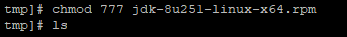
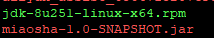
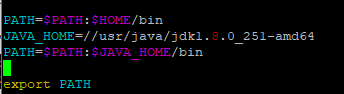
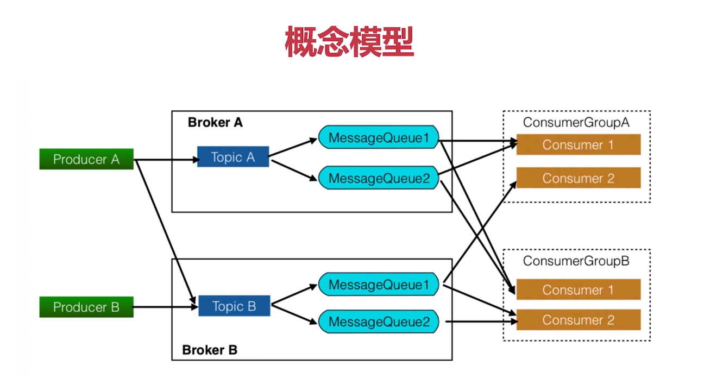
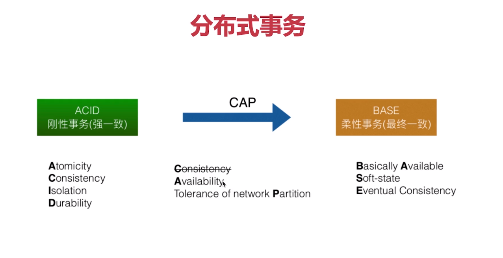

[秒杀课程地址](https://coding.imooc.com/learn/list/338.html)

### 秒杀基础构造

这是我在慕课网学习的实战课程！

#### Mybatis接入Springboot

pom.xml添加数据库和mybatis依赖

```xml
<dependency>
  <groupId>mysql</groupId>
  <artifactId>mysql-connector-java</artifactId>
  <version>8.0.19</version>
</dependency>
<dependency>
  <groupId>com.alibaba</groupId>
  <artifactId>druid</artifactId>
  <version>1.1.3</version>
</dependency>
<dependency>
  <groupId>org.mybatis.spring.boot</groupId>
  <artifactId>mybatis-spring-boot-starter</artifactId>
  <version>2.1.1</version>
</dependency>
```

pom.xml添加Mybatis自动生成插件

```xml
<plugin>
  <groupId>org.mybatis.generator</groupId>
  <artifactId>mybatis-generator-maven-plugin</artifactId>
  <version>1.3.5</version>
  <dependencies>
    <dependency>
      <groupId>org.mybatis.generator</groupId>
      <artifactId>mybatis-generator-core</artifactId>
      <version>1.3.5</version>
    </dependency>
    <dependency>
      <groupId>mysql</groupId>
      <artifactId>mysql-connector-java</artifactId>
      <version>8.0.19</version>
    </dependency>
  </dependencies>
  <executions>
    <execution>
      <id>mybatis generator</id>
      <phase>package</phase>
      <goals>
        <goal>generate</goal>
      </goals>
    </execution>
  </executions>
  <configuration>
    <!--允许移动生成的文件-->
    <verbose>true</verbose>
    <!--允许自动覆盖文件-->
    <overwrite>false</overwrite>
    <configurationFile>
      src/main/resources/mybatis-generator.xml
    </configurationFile>
  </configuration>
</plugin>
```

#### Mybatis自动生成器使用方式

mybatis-generator.xml

```xml
<?xml version="1.0" encoding="UTF-8"?>
<!DOCTYPE generatorConfiguration
        PUBLIC "-//mybatis.org//DTD MyBatis Generator Configuration 1.0//EN"
        "http://mybatis.org/dtd/mybatis-generator-config_1_0.dtd">
<generatorConfiguration>
    <context id="myBatis3"  targetRuntime="MyBatis3">
        <!--数据库链接地址账号密码-->
        <jdbcConnection driverClass="com.mysql.cj.jdbc.Driver"
                        connectionURL="jdbc:mysql://127.0.0.1:3306/miaosha?serverTimezone=UTC" userId="root" password="lijian123">
        </jdbcConnection>
        <!--生成DataObject类存放位置-->
        <javaModelGenerator targetPackage="com.miaoshaproject.dataobject" targetProject="src/main/java">
            <property name="enableSubPackages" value="true"/>
            <property name="trimStrings" value="true"/>
        </javaModelGenerator>

        <!--生成映射文件存放位置-->
        <sqlMapGenerator targetPackage="mapping" targetProject="src/main/resources">
            <property name="enableSubPackages" value="true"/>
        </sqlMapGenerator>

        <!--生成Dao类存放位置-->
        <javaClientGenerator type="XMLMAPPER" targetPackage="com.miaoshaproject.dao"
                             targetProject="src/main/java">
            <property name="enableSubPackages" value="true"/>
        </javaClientGenerator>

        <!--生成对应表及类名-->
        <table tableName="user_info" domainObjectName="UserDO" enableCountByExample="false"
               enableUpdateByExample="false" enableDeleteByExample="false"
               enableSelectByExample="false" selectByExampleQueryId="false" ></table>
        <table tableName="user_password" domainObjectName="UserPasswordDO" enableCountByExample="false"
               enableUpdateByExample="false" enableDeleteByExample="false"
               enableSelectByExample="false" selectByExampleQueryId="false"></table>
    </context>
</generatorConfiguration>
```
#### 使用SpringMVC方式开发用户信息

数据使用三层模型架构。

1. 数据库层
2. 业务信息逻辑处理层
3. 前台展示层

#### 定义通用返回体对象

```java
public class CommonReturnType {
    // 表明返回的请求结果 "success"或"fail"
    private String status;
    // 若status=success,则data内返回前端需要的json数据
    // 若status=fail,则data内使用通用的错误码格式
    private Object data;

    // 定义一个通用返回方法
    public static CommonReturnType create(Object result){
        return CommonReturnType.create(result, "success");
    }
    public static CommonReturnType create(Object result, String status){
        CommonReturnType commonReturnType = new CommonReturnType();
        commonReturnType.setStatus(status);
        commonReturnType.setData(result);
        return commonReturnType;
    }

    public String getStatus() {
        return status;
    }

    public void setStatus(String status) {
        this.status = status;
    }

    public Object getData() {
        return data;
    }

    public void setData(Object data) {
        this.data = data;
    }
}
```

#### 定义通用返回体对象--返回错误信息

1. 定义通用错误接口

   ```java
   public interface CommonError {
       int getErrorCode();
       String getErrorMessage();
       CommonError setErrMsg(String errMsg);
   }
   ```

2. 定义业务异常枚举类

   ```java
   public enum EmBusinessError implements CommonError {
       // 通用错误类型00001
       PARAMETER_VALIDATION_ERROR(00001,"参数不合法"),
   
       //10000 开头为用户信息相关错误定义
       USER_NOT_EXIST(10001,"用户不存在"),
   
       ;
   
       private int errCode;
       private String errMsg;
   
       EmBusinessError(int errCode, String errMsg) {
           this.errCode = errCode;
           this.errMsg = errMsg;
       }
   
       @Override
       public int getErrorCode() {
           return this.errCode;
       }
   
       @Override
       public String getErrorMessage() {
           return this.errMsg;
       }
   
       @Override
       public CommonError setErrMsg(String errMsg) {
           this.errMsg = errMsg;
           return this;
       }
   }
   ```

3. 定义业务异常

   ```java
   // 包装器业务异常类实现
   public class BusinessException extends Exception implements CommonError {
   
       private CommonError commonError;
   
       public CommonError getCommonError() {
           return commonError;
       }
   
       //直接接受EmBusinessError的传参用于构造业务异常
       public BusinessException(CommonError commonError) {
           super();
           this.commonError = commonError;
       }
   
       public BusinessException(CommonError commonError, String errMsg) {
           super();
           this.commonError = commonError;
           this.commonError.setErrMsg(errMsg);
       }
   
       public void setCommonError(CommonError commonError) {
           this.commonError = commonError;
       }
   
       @Override
       public int getErrorCode() {
           return this.commonError.getErrorCode();
       }
   
       @Override
       public String getErrorMessage() {
           return this.commonError.getErrorMessage();
       }
   
       @Override
       public CommonError setErrMsg(String errMsg) {
           this.commonError.setErrMsg(errMsg);
           return this;
       }
   }
   ```

#### 定义通用返回体对象--异常处理

定义基类来处理异常

```java
public class BaseController {
    //定义exceptionhandler解决未被controller层吸收的exception
    @ExceptionHandler(Exception.class)
    @ResponseStatus(HttpStatus.OK)
    @ResponseBody
    public Object handlerException(HttpServletRequest request, Exception ex){
        Map<String, Object> responseData = new HashMap<>();
        if(ex instanceof BusinessException){
            BusinessException businessException = (BusinessException)ex;
            responseData.put("errCode", businessException.getCommonError().getErrorCode());
            responseData.put("errMsg", businessException.getCommonError().getErrorMessage());
        }else{
            responseData.put("errCode", EmBusinessError.UNKNOW_ERROR.getErrorCode());
            responseData.put("errMsg", EmBusinessError.UNKNOW_ERROR.getErrorMessage());
        }
        return CommonReturnType.create(responseData, "fail");
    }
}
```

再让其他类继承基类

#### 用户模块管理模型--otp验证码获取

```java
// 用户获取otp短信接口
@RequestMapping("/getotp")
@ResponseBody
public CommonReturnType getotp(@RequestParam(name = "telphone")String telphone) throws BusinessException {
    //需要按照一定的规则生成OTP验证码
    Random random = new Random();
    int randomInt = random.nextInt(99999);//[0,99999)
    randomInt += 10000;//[10000,109999)
    String otpCode = String.valueOf(randomInt);
    //将OTP验证码同对应用户的手机号关联，使用httpsession的方式绑定他的手机号与OTPCODE
    httpServletRequest.getSession().setAttribute(telphone,otpCode);
    //将OTP验证码通过短信通道发送给用户,省略
    System.out.println("用户手机号" + telphone + "       &验证码" + otpCode);
    return CommonReturnType.create(null);
}
```

#### 优化校验规则

1. 引入依赖

   ```xml
   <dependency>
     <groupId>org.hibernate</groupId>
     <artifactId>hibernate-validator</artifactId>
     <version>5.2.4.Final</version>
   </dependency>
   ```

2. 创建校验结果类

   ```java
   public class ValidationResult {
       //校验结果是否有错
       private boolean hasErrors = false;
       //存放错误信息的map
       private Map<String, String> errorsMsgMap = new HashMap<>();
   
       public boolean isHasErrors() {
           return hasErrors;
       }
   
       public void setHasErrors(boolean hasErrors) {
           this.hasErrors = hasErrors;
       }
   
       public Map<String, String> getErrorsMsgMap() {
           return errorsMsgMap;
       }
   
       public void setErrorsMsgMap(Map<String, String> errorsMsgMap) {
           this.errorsMsgMap = errorsMsgMap;
       }
   
       //实现通用的通过格式化字符串信息获取错误结果的msg方法
       public String getErrMsg(){
           return StringUtils.join(errorsMsgMap.values(),",");
       }
   }
   ```

3. 构造校验器

   ```java
   @Component
   public class ValidatorImpl implements InitializingBean {
       private Validator validator;
   
       //实现校验方法并返回校验结果
       public ValidationResult validate(Object bean){
           final ValidationResult result = new ValidationResult();
           Set<ConstraintViolation<Object>> constraintViolationSet = validator.validate(bean);
           if(constraintViolationSet.size() > 0){
               // 有错误
               result.setHasErrors(true);
               constraintViolationSet.forEach(constraintViolation -> {
                   String errMsg = constraintViolation.getMessage();
                   String propertyName = constraintViolation.getPropertyPath().toString();
                   result.getErrorsMsgMap().put(propertyName,errMsg);
               });
           }
           return result;
       }
   
       @Override
       public void afterPropertiesSet() throws Exception {
           //将hibernate validator通过工厂的初始化方式使其实例化
           this.validator = Validation.buildDefaultValidatorFactory().getValidator();
       }
   }
   ```

4. 使用校验器

   ```java
   @NotNull(message = "年龄不能不填写")
   @Min(value = 0,message = "年龄必须大于0岁")
   @Max(value = 150,message = "年龄必须小于150岁")
   private Integer age;
   ```

   ```java
   ValidationResult result = validator.validate(userModel);
   if(result.isHasErrors()){
       throw new BusinessException(EmBusinessError.PARAMETER_VALIDATION_ERROR, result.getErrMsg());
   }
   ```

### 部署学习 

##### Java环境部署

1. 购买一台阿里服务器

2. 在Windows 安装 Putty 对数据库进行连接

3. 将jar包从windows发送到阿里云服务器 scp miaosha-1.0-SNAPSHOT.jar root@****（阿里云服务器地址）:/tmp/

4. 在阿里云配置java环境

   ​	a. 下载 Java8 rpm 从 Oracle 官网到windows

   ​	b.  打开windows cmd 输入：scp jdk-8u251-linux-x64.rpm root@****（阿里云服务器地址）:/tmp/

   ​	c.  登陆阿里云服务器，输入：ls 查看我们往阿里云传输的文件

   ​	d. 可以看到我们传输的文件

   ​	e. 给rpm安装包（可读可写可执行）的权限这时		rpm安装包就变绿了；

   ​	f. 安装java，输入rpm -ivh jdk-8u251-linux-x64.rpm 安装 会安装到 //usr/java 目录下，在该目录下输入java -version验证

   ​	g. 配置java环境变量，回到根目录 cd ~ 输入： vim ~/.bash_profile

   ​		

   ​		添加环境变量保存退出后：source ~/.bash_profile （重新执行刚修改的初始化文件，使之立即生效，而不必注销并重新登录。）

   ​		然后输入java -version 经行验证。

###  性能优化

#### 分布式会话

基于cookie传输sessionid：java tomcat容器session实现迁移到redis

UserController

```java
 httpServletRequest.getSession().setAttribute("IS_LOGIN", true);
 httpServletRequest.getSession().setAttribute("LOGIN_USER", userModel);
```

OrderController

```java
Boolean isLogin = (Boolean) httpServletRequest.getSession().getAttribute("IS_LOGIN");
if(isLogin == null || !isLogin.booleanValue()){
    throw new BusinessException(EmBusinessError.USER_NOT_LOGIN,"用户还未登陆，不能下单");
}
```

基于token传输类似sessionid：Java代码session实现迁移到redis

UserController

```java
String uuidToken = UUID.randomUUID().toString();
uuidToken = uuidToken.replace("-","");
// 生成登陆凭证 token uuid（保证全局唯一）
redisTemplate.opsForValue().set(uuidToken, userModel);
// 过期时间1小时
redisTemplate.expire(uuidToken,1, TimeUnit.HOURS);
return CommonReturnType.create(uuidToken);
```

前台接受token

var token = data.data;
window.localStorage["token"]=token;

前台向后台发送token

var token = window.localStorage["token"];

url:"http://"+g_host+"/order/createorder?token="+token

OrderController

```java
String token = httpServletRequest.getParameterMap().get("token")[0];
if(StringUtils.isEmpty(token)){
    throw new BusinessException(EmBusinessError.USER_NOT_LOGIN,"用户还未登陆，不能下单");
}
//获取用户的登陆信息
UserModel userModel = (UserModel)redisTemplate.opsForValue().get(token);
if(userModel == null){
	throw new BusinessException(EmBusinessError.USER_NOT_LOGIN,"用户还未登陆，不能下单");
}
```

1. 添加redis相关依赖

```xml
<dependency>
  <groupId>org.springframework.boot</groupId>
  <artifactId>spring-boot-starter-data-redis</artifactId>
</dependency>
<dependency>
      <groupId>org.springframework.session</groupId>
      <artifactId>spring-session-data-redis</artifactId>
      <version>2.2.0.RELEASE</version>
    </dependency>
```

2. 添加redis配置类

```java
@Component
@EnableRedisHttpSession(maxInactiveIntervalInSeconds = 3600)
public class RedisConfig {
}
```

2. 指定redis端口

```xml
#配置springboot对redis的依赖
spring.redis.host=127.0.0.1
spring.redis.port=6379
spring.redis.database=10
#spring.redis.password=

#设置jedis连接池
spring.redis.jedis.pool.max-active=50
spring.redis.jedis.pool.min-idle=20
```

* redis默认序列化的方式就是jdk的序列化方式，因此要存入redis的对象，一定要实现Serializable接口。

#### Redis集中式缓存商品详情

```java
// 商品详情页浏览
@RequestMapping(value = "/get", method = {RequestMethod.GET})
@ResponseBody
public CommonReturnType getItem(@RequestParam(name = "id")Integer id){
    // 根据商品id到redis内获取
    Object object = redisTemplate.opsForValue().get("item_"+id);
    JSONObject jsonObject = JSON.parseObject(JSON.toJSONString(object));
    ItemModel itemModel = null;
    if(jsonObject != null){
         itemModel = jsonObject.toJavaObject(ItemModel.class);
    }
    // ItemModel itemModel = (ItemModel)redisTemplate.opsForValue().get("item_"+id);

    // 若reids内不存在对应的ItemModel,则访问下游的service
    if(itemModel == null){
        itemModel = itemService.getItemById(id);
        // 设置itemModel到redis内
        redisTemplate.opsForValue().set("item_"+id,itemModel);
        redisTemplate.expire("item_"+id, 10, TimeUnit.MINUTES);
    }

    ItemVO itemVO = this.convertVOFromModel(itemModel);
    return CommonReturnType.create(itemVO);
}
```

改写redisTemplate

```java
@Bean
public RedisTemplate redisTemplate(RedisConnectionFactory redisConnectionFactory){
    RedisTemplate redisTemplate = new RedisTemplate();
    redisTemplate.setConnectionFactory(redisConnectionFactory);
    // 首先解决key 的序列化方式
    StringRedisSerializer stringRedisSerializer = new StringRedisSerializer();
    redisTemplate.setKeySerializer(stringRedisSerializer);
    // 解决value的序列化方式
    Jackson2JsonRedisSerializer<Object> jackson2JsonRedisSerializer = new Jackson2JsonRedisSerializer(Object.class);

    ObjectMapper objectMapper = new ObjectMapper();
    SimpleModule simpleModule = new  SimpleModule();
    simpleModule.addSerializer(DateTime.class, new JodaDateTimeSerializer());
    simpleModule.addDeserializer(DateTime.class, new JodaDateTimeDeserializer());
    objectMapper.activateDefaultTyping(LaissezFaireSubTypeValidator.instance, ObjectMapper.DefaultTyping.NON_FINAL);
    objectMapper.registerModule(simpleModule);
    jackson2JsonRedisSerializer.setObjectMapper(objectMapper);

    redisTemplate.setValueSerializer(jackson2JsonRedisSerializer);
    return redisTemplate;
}
```

JodaTime序列化和反序列化方式

```java
public class JodaDateTimeSerializer extends JsonSerializer<DateTime> {
    @Override
    public void serialize(DateTime dateTime, JsonGenerator jsonGenerator, SerializerProvider serializerProvider) throws IOException {
        jsonGenerator.writeString(dateTime.toString("yyyy-MM-dd HH:mm:ss"));
    }
}
public class JodaDateTimeDeserializer extends JsonDeserializer<DateTime> {

    @Override
    public DateTime deserialize(JsonParser jsonParser, DeserializationContext deserializationContext) throws IOException, JsonProcessingException {
        String dateString = jsonParser.readValueAs(String.class);
        DateTimeFormatter formatter = DateTimeFormat.forPattern("yyyy-MM-dd HH:mm:ss");
        return DateTime.parse(dateString,formatter);
    }
}
```

#### 本地热点数据缓存

方案：Guava cache

1. 引入依赖

   ```xml
   <dependency>
     <groupId>com.google.guava</groupId>
     <artifactId>guava</artifactId>
     <version>18.0</version>
   </dependency>
   ```

2. 封装本地缓存操作类

```java
// 封装本地缓存操作类
public interface CacheService {
    // 存方法
    void setCommmonCache(String key, Object object);
    // 取方法
    Object getFromCommonCache(String key);
}
@Service
public class CacheServiceImpl implements CacheService {

    private Cache<String, Object> commonCache = null;

    @PostConstruct
    public void innit(){
        commonCache = CacheBuilder.newBuilder()
                // 设置缓存器初始容量为10
                .initialCapacity(10)
                //设置缓存中最大可以存储100个key，超过100个之后会按照LRU的策略移除缓存项
                .maximumSize(100)
                // 设置过期时间
                .expireAfterWrite(60, TimeUnit.SECONDS)
                .build();
    }

    @Override
    public void setCommmonCache(String key, Object object) {
        commonCache.put(key, object);
    }

    @Override
    public Object getFromCommonCache(String key) {
        return commonCache.getIfPresent(key);
    }
}
```

```java
// 商品详情页浏览
@RequestMapping(value = "/get", method = {RequestMethod.GET})
@ResponseBody
public CommonReturnType getItem(@RequestParam(name = "id")Integer id){
    ItemModel itemModel = null;
    // 先取本地缓存
    itemModel = (ItemModel) cacheService.getFromCommonCache("item_"+id);
    if(itemModel == null){
        // 根据商品id到redis内获取
        Object object = redisTemplate.opsForValue().get("item_"+id);
        JSONObject jsonObject = JSON.parseObject(JSON.toJSONString(object));

        if(jsonObject != null){
            itemModel = jsonObject.toJavaObject(ItemModel.class);
        }
        // ItemModel itemModel = (ItemModel)redisTemplate.opsForValue().get("item_"+id);
        // 若reids内不存在对应的ItemModel,则访问下游的service
        if(itemModel == null){
            itemModel = itemService.getItemById(id);
            // 设置itemModel到redis内
            redisTemplate.opsForValue().set("item_"+id,itemModel);
            redisTemplate.expire("item_"+id, 10, TimeUnit.MINUTES);
        }
        cacheService.setCommmonCache("item_"+id,itemModel);
    }
    ItemVO itemVO = this.convertVOFromModel(itemModel);
    return CommonReturnType.create(itemVO);
}
```

#### 库存行锁优化

1.  扣减库存缓存化
   1. 方案：
      1. 活动发布同步库存进缓存
      2. 下单交易减缓存库存
   2. 问题：
      1. 数据库记录不一致

2. 同步异步数据库

   1. 方案：

      1. 活动发布同步库存进缓存
      2. 下单交易减缓存库存
      3. 异步消息扣减数据库内库存（使用rocketmq）

      ```xml
      <dependency>
        <groupId>org.apache.rocketmq</groupId>
        <artifactId>rocketmq-client</artifactId>
        <version>4.3.0</version>
      </dependency>
      ```

      ```properties
      mq.nameserver.addr=127.0.0.1:9876
      mq.topicname=stock
      ```

      ```java
      @Override
      @Transactional
      public boolean decreaseStock(Integer itemId, Integer amount) throws BusinessException {
          //int affectedRow= itemStockDOMapper.decreaseStock(itemId,amount);
          long result = redisTemplate.opsForValue().increment("promo_item_stock_"+itemId, amount.intValue()*-1);
          if(result > 0){
              // 更新库存成功
              boolean sendResult = mqProducer.asyncReduceStock(itemId, amount);
              if(!sendResult){
                  redisTemplate.opsForValue().increment("promo_item_stock_"+itemId, amount.intValue());
                  return false;
              }
              return true;
          }else{
              redisTemplate.opsForValue().increment("promo_item_stock_"+itemId, amount.intValue());
              return false;
          }
      }
      ```

      ```java
      @Component
      public class MqConsumer {
          @Autowired
          private ItemStockDOMapper itemStockDOMapper;
      
          private DefaultMQPushConsumer consumer;
      
          @Value("${mq.nameserver.addr}")
          private String nameAddr;
      
          @Value("${mq.topicname}")
          private String topicname;
      
          @PostConstruct
          public void init() throws MQClientException {
              consumer = new DefaultMQPushConsumer("stock_consumer_group");
              consumer.setNamesrvAddr(nameAddr);
              consumer.subscribe(topicname,"*");
              consumer.registerMessageListener(new MessageListenerConcurrently() {
                  @Override
                  public ConsumeConcurrentlyStatus consumeMessage(List<MessageExt> list, ConsumeConcurrentlyContext consumeConcurrentlyContext) {
                      // 实现库存真正到数据库内扣减的逻辑
                      Message message = list.get(0);
                      String jsonString = new String(message.getBody());
                      Map<String,Object> map = JSON.parseObject(jsonString, Map.class);
                      Integer itemId = (Integer)map.get("itemId");
                      Integer amount = (Integer)map.get("amount");
                      itemStockDOMapper.decreaseStock(itemId, amount);
                      return ConsumeConcurrentlyStatus.CONSUME_SUCCESS;
                  }
              });
              consumer.start();
          }
      }
      @Component
      public class MqProducer {
      
          private DefaultMQProducer producer;
      
          @Value("${mq.nameserver.addr}")
          private String nameAddr;
      
          @Value("${mq.topicname}")
          private String topicname;
      
          @PostConstruct
          public void init() throws MQClientException {
              // 做mq producer的初始化
              producer = new DefaultMQProducer("producer_group");
              producer.setNamesrvAddr(nameAddr);
              producer.start();
          }
      
          //同步库存扣减方法
          public boolean asyncReduceStock(Integer itemId,Integer amount) {
              Map<String, Object> bodyMap = new HashMap<>();
              bodyMap.put("itemId", itemId);
              bodyMap.put("amount", amount);
              Message message = new Message(topicname, "increase", JSON.toJSONString(bodyMap).getBytes(Charset.forName("UTF-8")));
              try {
                  producer.send(message);
              } catch (MQClientException e) {
                  e.printStackTrace();
                  return false;
              } catch (RemotingException e) {
                  e.printStackTrace();
                  return false;
              } catch (MQBrokerException e) {
                  e.printStackTrace();
                  return false;
              } catch (InterruptedException e) {
                  e.printStackTrace();
                  return false;
              }
              return true;
          }
      }
      ```

   2. 问题：

      1. 异步消息发送失败
      2. 扣减库存执行失败
      3. 下单失败无法正确回补库存

      

      分布式事务

      

      

3. 库存数据库最终一致性

```java
if(!mqProducer.transactionAsyncReduceStock(userModel.getId(),itemId,promoId,amount,stockLogId)){
    throw new BusinessException(EmBusinessError.UNKNOW_ERROR,"下单失败");
}
```

```java
@PostConstruct
public void init() throws MQClientException {
    // 做mq producer的初始化
    producer = new DefaultMQProducer("producer_group");
    producer.setNamesrvAddr(nameAddr);
    producer.start();

    transactionMQProducer = new TransactionMQProducer("transaction_producer_group");
    transactionMQProducer.setNamesrvAddr(nameAddr);
    transactionMQProducer.start();

    transactionMQProducer.setTransactionListener(new TransactionListener() {
        @Override
        public LocalTransactionState executeLocalTransaction(Message message, Object o) {
            //真正要做的事 创建订单
            Integer userId = (Integer) ((Map)o).get("userId");
            Integer itemId = (Integer) ((Map)o).get("itemId");
            Integer promoId = (Integer) ((Map)o).get("promoId");
            Integer amount = (Integer) ((Map)o).get("amount");
            String stockLogId = (String) ((Map)o).get("stockLogId");
            try {
                orderService.createOrder(userId,itemId,promoId,amount,stockLogId);
            } catch (BusinessException e) {
                e.printStackTrace();
                //设置对应的stocklog为回滚状态
                StockLogDO stockLogDO = stockLogDOMapper.selectByPrimaryKey(stockLogId);
                stockLogDO.setStatus(3);
                stockLogDOMapper.updateByPrimaryKeySelective(stockLogDO);
                return  LocalTransactionState.ROLLBACK_MESSAGE;
            }
            return LocalTransactionState.COMMIT_MESSAGE;
        }

        @Override
        public LocalTransactionState checkLocalTransaction(MessageExt messageExt) {
            //根据是否扣减库存成功，来判断要返回COMMIT,ROLLBACK还是继续UNKNOWN
            String jsonString = new String(messageExt.getBody());
            Map<String,Object> map = JSON.parseObject(jsonString, Map.class);
            Integer itemId = (Integer)map.get("itemId");
            Integer amount = (Integer)map.get("amount");
            String stockLogId = (String)map.get("stockLogId");
            StockLogDO stockLogDO = stockLogDOMapper.selectByPrimaryKey(stockLogId);
            if(stockLogDO == null){
                return LocalTransactionState.UNKNOW;
            }
            if(stockLogDO.getStatus().intValue() == 2){
                return LocalTransactionState.COMMIT_MESSAGE;
            }else if(stockLogDO.getStatus().intValue() == 1){
                return LocalTransactionState.UNKNOW;
            }
            return LocalTransactionState.ROLLBACK_MESSAGE;
        }
    });
}

//事务型同步库存扣减方法
public boolean transactionAsyncReduceStock(Integer userId,Integer itemId,Integer promoId,Integer amount,String stockLogId) {

    Map<String, Object> bodyMap = new HashMap<>();
    bodyMap.put("itemId", itemId);
    bodyMap.put("amount", amount);
    bodyMap.put("stockLogId", stockLogId);
    Map<String, Object> argsMap = new HashMap<>();
    argsMap.put("userId", userId);
    argsMap.put("itemId", itemId);
    argsMap.put("promoId", promoId);
    argsMap.put("amount", amount);
    argsMap.put("stockLogId", stockLogId);


    Message message = new Message(topicname, "increase", JSON.toJSONString(bodyMap).getBytes(Charset.forName("UTF-8")));
    TransactionSendResult sendResult = null;
    try {
        sendResult = transactionMQProducer.sendMessageInTransaction(message, argsMap);
    } catch (MQClientException e) {
        e.printStackTrace();
        return false;
    }
    if(sendResult.getLocalTransactionState() == LocalTransactionState.ROLLBACK_MESSAGE){
        return false;
    }else if(sendResult.getLocalTransactionState() == LocalTransactionState.COMMIT_MESSAGE){
        return true;
    }else{
        return false;
    }
}
```

#### 流量削峰技术

1. 秒杀令牌
   1. 秒杀接口令牌才能进入
   2. 秒杀的令牌由活动模块负责生成
   3. 秒杀活动模块对秒杀令牌生成全权处理，逻辑收口
   4. 秒杀下单前需要先获取秒杀令牌
2. 秒杀大闸
3. 队列泄洪

#### 防刷限流技术

1. 验证码技术（错峰流量）
2. 令牌桶


