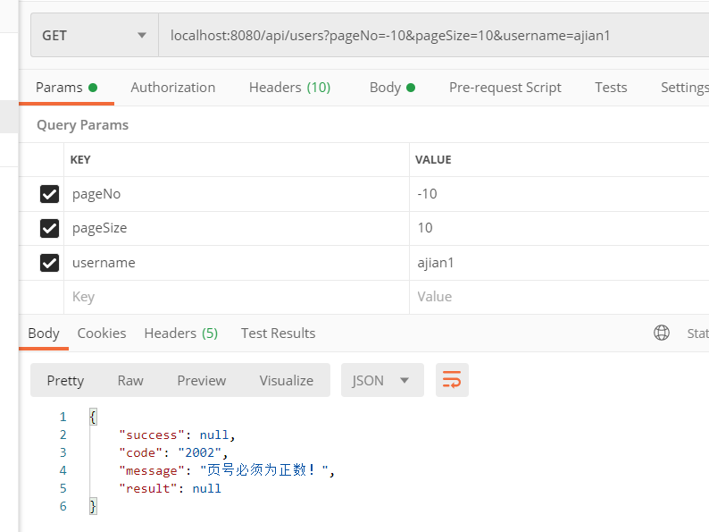

[高效编程课程地址](https://coding.imooc.com/class/382.html)

### 统一异常处理

实现一个用@ControllerAdvice修饰的异常处理类：

```java
/**
 * <h1>全局异常捕获处理器</h1>
 * @Author: crowsjian
 * @Date: 2020/7/13 21:23
 */
@ControllerAdvice
@Slf4j
public class GlobalExceptionHandler {


    /**
     * <h2>捕捉业务异常</h2>
     * @param e
     * @return
     */
    @ResponseBody
    @ExceptionHandler(value = BusinessException.class)
    public ResponseResult BusinessExceptionHandle(BusinessException e){
        log.error("捕捉到业务类异常：",e);
        return ResponseResult.failure(e.getCode(),e.getMessage());
    }

    /**
     * <h2>拦截运行时异常</h2>
     * @param e
     */
    @ResponseBody
    @ExceptionHandler(value = RuntimeException.class)
    public ResponseResult runtimeExceptionHandle(RuntimeException e){
        log.error("捕捉到运行时异常：",e);
        return ResponseResult .failure(ErrorCodeEnum.UNKNOWN_ERROR.getCode(),e.getMessage());
    }

    /**
     * <h2>捕捉系统级异常</h2>
     * @param th
     * @return
     */
    @ResponseBody
    @ExceptionHandler(value = Throwable.class)
    public ResponseResult throwableHandle(Throwable th){
        log.error("捕捉Throwable异常:",th);
        return ResponseResult.failure(ErrorCodeEnum.SYSTEM_ERROR.getCode(),th.getMessage());
    }
}  
```

业务异常类

```java
/**
 * <h1>业务类异常</h1>
 * @Author: crowsjian
 * @Date: 2020/7/13 21:52
 */
public class BusinessException extends RuntimeException {
    /*异常编号*/
    @Getter
    private final String code;

    /**
     * <h2>根据枚举构造业务类异常</h2>
     * @param errorCodeEnum
     */
    public BusinessException(ErrorCodeEnum errorCodeEnum){
        super(errorCodeEnum.getMessage());
        this.code = errorCodeEnum.getCode();
    }

    /**
     * <h2>自定义消息体构造业务类异常</h2>
     * @param errorCodeEnum
     * @param message
     */
    public BusinessException(ErrorCodeEnum errorCodeEnum,String message){
        super(message);
        this.code = errorCodeEnum.getCode();
    }

    /**
     * <h2>根据异常构造业务类异常</h2>
     * @param errorCodeEnum
     * @param cause
     */
    public BusinessException(ErrorCodeEnum errorCodeEnum,Throwable cause){
        super(cause);
        this.code = errorCodeEnum.getCode();
    }

}
```

异常编码枚举类：

```java
/**
 * <h1>异常编码枚举类</h1>
 * @Author: crowsjian
 * @Date: 2020/7/12 12:28
 */
@AllArgsConstructor
@NoArgsConstructor
@Getter
public enum  ErrorCodeEnum {
    // 0*** 成功
    SUCCESS("0000","操作成功"),
    // 1*** 参数异常
    PARAM_ERROR("1001","参数异常"),
    PARAM_NULL("1002","参数为空"),
    PARAM_FORMAT_ERROR("1003","参数格式不正确"),
    PARAM_VALUE_ERROR("1004","参数值不正确"),
    // 2*** 服务异常
    SYSTEM_ERROR("2001","服务异常"),
    UNKNOWN_ERROR("2002","未知异常"),
    // 3*** 业务类异常
    XXX("3001","业务异常"),
    INSERT_FAILURE("3002","新增失败"),
    UPDATE_FAILURE("3003","更新失败"),
    DELETE_FAILURE("3004","删除失败"),
    ;
    private String code;
    private String message;
}
```

例子：

```java
/*当前页*/
@NotNull(message = "页号不能为空！")
@Min(value=1,message = "页号必须为正数！")
private Integer pageNo = 1;

/**
* <h2>参数校验</h2>
* @param object
* @param groups
* @param <T>
*/
public static <T> void validate(T object,Class... groups){
    Set<ConstraintViolation<T>> validate = validator.validate(object,groups);
    // 如果校验结果不为空
    if(!CollectionUtils.isEmpty(validate)){
        StringBuilder exceptionMessage = new StringBuilder();
        validate.forEach(constraintViolation->{
       	 	exceptionMessage.append(constraintViolation.getMessage());
        });
        throw new RuntimeException(exceptionMessage.toString());
    }
}
```



