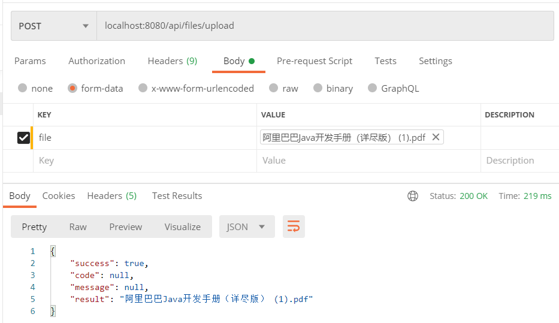

[高效编程课程地址](https://coding.imooc.com/class/382.html)

### 统一异常处理

实现一个用@ControllerAdvice修饰的异常处理类：

```java
/**
 * <h1>全局异常捕获处理器</h1>
 * @Author: crowsjian
 * @Date: 2020/7/13 21:23
 */
@ControllerAdvice
@Slf4j
public class GlobalExceptionHandler {


    /**
     * <h2>捕捉业务异常</h2>
     * @param e
     * @return
     */
    @ResponseBody
    @ExceptionHandler(value = BusinessException.class)
    public ResponseResult BusinessExceptionHandle(BusinessException e){
        log.error("捕捉到业务类异常：",e);
        return ResponseResult.failure(e.getCode(),e.getMessage());
    }

    /**
     * <h2>拦截运行时异常</h2>
     * @param e
     */
    @ResponseBody
    @ExceptionHandler(value = RuntimeException.class)
    public ResponseResult runtimeExceptionHandle(RuntimeException e){
        log.error("捕捉到运行时异常：",e);
        return ResponseResult .failure(ErrorCodeEnum.UNKNOWN_ERROR.getCode(),e.getMessage());
    }

    /**
     * <h2>捕捉系统级异常</h2>
     * @param th
     * @return
     */
    @ResponseBody
    @ExceptionHandler(value = Throwable.class)
    public ResponseResult throwableHandle(Throwable th){
        log.error("捕捉Throwable异常:",th);
        return ResponseResult.failure(ErrorCodeEnum.SYSTEM_ERROR.getCode(),th.getMessage());
    }
}  
```

业务异常类

```java
/**
 * <h1>业务类异常</h1>
 * @Author: crowsjian
 * @Date: 2020/7/13 21:52
 */
public class BusinessException extends RuntimeException {
    /*异常编号*/
    @Getter
    private final String code;

    /**
     * <h2>根据枚举构造业务类异常</h2>
     * @param errorCodeEnum
     */
    public BusinessException(ErrorCodeEnum errorCodeEnum){
        super(errorCodeEnum.getMessage());
        this.code = errorCodeEnum.getCode();
    }

    /**
     * <h2>自定义消息体构造业务类异常</h2>
     * @param errorCodeEnum
     * @param message
     */
    public BusinessException(ErrorCodeEnum errorCodeEnum,String message){
        super(message);
        this.code = errorCodeEnum.getCode();
    }

    /**
     * <h2>根据异常构造业务类异常</h2>
     * @param errorCodeEnum
     * @param cause
     */
    public BusinessException(ErrorCodeEnum errorCodeEnum,Throwable cause){
        super(cause);
        this.code = errorCodeEnum.getCode();
    }

}
```

异常编码枚举类：

```java
/**
 * <h1>异常编码枚举类</h1>
 * @Author: crowsjian
 * @Date: 2020/7/12 12:28
 */
@AllArgsConstructor
@NoArgsConstructor
@Getter
public enum  ErrorCodeEnum {
    // 0*** 成功
    SUCCESS("0000","操作成功"),
    // 1*** 参数异常
    PARAM_ERROR("1001","参数异常"),
    PARAM_NULL("1002","参数为空"),
    PARAM_FORMAT_ERROR("1003","参数格式不正确"),
    PARAM_VALUE_ERROR("1004","参数值不正确"),
    // 2*** 服务异常
    SYSTEM_ERROR("2001","服务异常"),
    UNKNOWN_ERROR("2002","未知异常"),
    // 3*** 业务类异常
    XXX("3001","业务异常"),
    INSERT_FAILURE("3002","新增失败"),
    UPDATE_FAILURE("3003","更新失败"),
    DELETE_FAILURE("3004","删除失败"),
    ;
    private String code;
    private String message;
}
```

例子：

```java
/*当前页*/
@NotNull(message = "页号不能为空！")
@Min(value=1,message = "页号必须为正数！")
private Integer pageNo = 1;

/**
* <h2>参数校验</h2>
* @param object
* @param groups
* @param <T>
*/
public static <T> void validate(T object,Class... groups){
    Set<ConstraintViolation<T>> validate = validator.validate(object,groups);
    // 如果校验结果不为空
    if(!CollectionUtils.isEmpty(validate)){
        StringBuilder exceptionMessage = new StringBuilder();
        validate.forEach(constraintViolation->{
       	 	exceptionMessage.append(constraintViolation.getMessage());
        });
        throw new RuntimeException(exceptionMessage.toString());
    }
}
```


### 集成CaffeineCache缓存功能

1. @Cacheable：缓存数据，一般用在查询方法上。将查询到的数据进行缓存。

   @Cacheput：更新缓存，将数据从缓存中进行更新

   @CacheEvict(evict:驱逐)：删除缓存

2. cache的相关依赖

   ```xml
   <dependency>
       <groupId>org.springframework</groupId>
       <artifactId>spring-context-support</artifactId>
   </dependency>
   <!--Caffeine Cache支持-->
   <dependency>
       <groupId>com.github.ben-manes.caffeine</groupId>
       <artifactId>caffeine</artifactId>
   </dependency>
   ```

3. CacheManager Bean

   ```java
   /**
    * <h1>缓存管理器配置</h1>
    * @Author: crowsjian
    * @Date: 2020/7/14 22:08
    */
   @Configuration
   @EnableCaching
   @Slf4j
   public class CaffeineCacheConfig {
       /**
        * <h2>CacheManager实现类</h2>
        * @return
        */
       @Bean("cacheManager")
       public CacheManager cacheManager(){
           SimpleCacheManager cacheManager = new SimpleCacheManager();
           // 缓存集合
           ArrayList<CaffeineCache> caches = new ArrayList<>();
           caches.add(new CaffeineCache("users-cache",
                   Caffeine.newBuilder()
                           // 指定key下的最大缓存数据量
                           .maximumSize(1000)
                           // 最后一次访问之后 120秒 过期
                           .expireAfterAccess(120, TimeUnit.SECONDS)
                           .build()));
           cacheManager.setCaches(caches);
           return cacheManager;
       }
   }
   ```

4. 使用注解，标识我们的哪儿些方法需要缓存

   ```java
   /**
    * <h2>查询用户信息</h2>
    * @param pageNo
    * @param pageSize
    * @param query
    * @return
    */
   @Cacheable(cacheNames = "users-cache")
   @GetMapping
   public ResponseResult<PageResult> query(@NotNull Integer pageNo,
                                           @NotNull Integer pageSize,
                                           @Validated UserQueryDTO query){
       log.info("未使用缓存！");
   ```

   ```java
   /**
    * <h2>新增用户</h2>
    * POST /api/user UserDTO
    * @param userDTO
    * @return
    */
   @CacheEvict(cacheNames = "users-cache",allEntries = true)//allEntries所有进入该方法都会清缓存
   @PostMapping
   public ResponseResult save(@Validated(InsertValidationGroup.class)@RequestBody UserDTO userDTO){
       int save = userService.save(userDTO);
       if(save == 1){
           return ResponseResult.success("新增成功！");
       }else{
           return ResponseResult.failure(ErrorCodeEnum.INSERT_FAILURE);
       }
   }
   ```

### 集成Guava令牌桶实现全局限流功能

1. 先在pom.xml中引入Guava工具包的支持

   ```xml
   <!--Guava-->
   <dependency>
       <groupId>com.google.guava</groupId>
       <artifactId>guava</artifactId>
       <version>28.2-jre</version>
   </dependency>
   ```

2. 定义一个拦截器，实现令牌的发放和获取

   ```java
   /**
    * <h1>全局限流拦截器</h1>
    * @Author: crowsjian
    * @Date: 2020/7/15 18:57
    */
   @Slf4j
   @Component
   public class RateLimitIntercepter implements HandlerInterceptor {
   
       /*限流器实例（QPS限制为10）*/
       private static final RateLimiter rateLimiter = RateLimiter.create(1);
   
       @Override
       public boolean preHandle(HttpServletRequest request,
                                HttpServletResponse response,
                                Object handler) throws Exception {
           if(!rateLimiter.tryAcquire()){
               log.error("系统已经被限流了。");
               throw new BusinessException(ErrorCodeEnum.RATE_LIMIT_ERROR);
           }
           return true;
       }
   }
   ```

3. 将拦截器配置到web系统中

   ```java
   /**
    * <h1>Web配置类</h1>
    * @Author: crowsjian
    * @Date: 2020/7/15 19:33
    */
   @Configuration
   @EnableWebMvc
   @Slf4j
   public class WebConfig implements WebMvcConfigurer {
       /*全局限流拦截器*/
       @Resource
       private RateLimitIntercepter rateLimitIntercepter;
   
       /**
        * <h2>向Web中添加拦截器</h2>
        * @param registry
        */
       @Override
       public void addInterceptors(InterceptorRegistry registry) {
           //配置限流拦截器，拦截所有以/api/开头的请求
           registry.addInterceptor(rateLimitIntercepter)
                   .addPathPatterns("/api/**");
       }
   
       /**
        * <h2>静态资源配置</h2>
        * @param registry
        */
       @Override
       public void addResourceHandlers(ResourceHandlerRegistry registry) {
   
       }
   }
   ```

### 使用TraceId实现日志跟踪

1. 建立一个过滤器，在过滤器中给线程设置TraceId

   ```java
   /**
    * <h1>TraceId过滤器</h1>
    * @Author: crowsjian
    * @Date: 2020/7/15 22:41
    */
   @WebFilter(urlPatterns = "/*")
   @Order(1)
   public class TraceIdFilter implements Filter {
   
       /*TraceId 常量*/
       private static final String TRACE_ID = "traceId";
   
       @Override
       public void doFilter(ServletRequest servletRequest,
                            ServletResponse servletResponse,
                            FilterChain filterChain) throws IOException, ServletException {
           // 尝试从请求信息中获取TraceId信息
           String traceId = servletRequest.getParameter(TRACE_ID);
           // 为空设置默认值
           if(StringUtils.isEmpty(traceId)){
               traceId = UUID.randomUUID().toString();
           }
           //在MDC中放入TraceId
           MDC.put(TRACE_ID,traceId);
           filterChain.doFilter(servletRequest,servletResponse);
       }
   }
   ```

   再给启动类加上这个注解

   ```java
   @ServletComponentScan
   ```

2. 将日志配置文件进行修改，把TraceId打印到日志中

   在配置文件中输入：

   ```java
   #日志输出格式
   logging.pattern.console=%clr(%d{${LOG_DATEFORMAT_PATTERN:yyyy-MM-dd HH:mm:ss.SSS}}){faint} %clr(${LOG_LEVEL_PATTERN:-%5p}) %clr([%X{traceId}]) %clr(${PID:- }){magenta} %clr(---){faint} %clr([%15.15t]){faint} %clr(%-40.40logger{39}){cyan} %clr(:){faint} %m%n
   ```

### 文件上传下载

1. 文件上传的Controller，负责处理文件上传

   ```java
   /**
    * <h1>文件服务Controller</h1>
    * @Author: crowsjian
    * @Date: 2020/7/16 21:40
    */
   @RestController
   @RequestMapping("/api/files")
   @Slf4j
   public class FileController {
   
       @Resource(name = "fileServiceImpl")
       private FileService fileService;
   
       /**
        * <h2>文件上传</h2>
        * @param file
        * @return
        */
       @PostMapping("/upload")
       public ResponseResult<String> upload(@NotNull MultipartFile file){
           // 文件上传..
           try {
               fileService.upload(file.getInputStream(),file.getOriginalFilename());
           } catch (Exception e) {
               log.error("文件上传失败",e);
               throw new BusinessException(ErrorCodeEnum.FILE_UPLOAD_ERROR,e);
           }
           return ResponseResult.success(file.getOriginalFilename());
       }
   }
   ```

2. 文件上传的服务接口，通过接口的形式来定义出文件上传的功能

   ```java
   /**
    * <h1>文件上传服务接口</h1>
    * @Author: crowsjian
    * @Date: 2020/7/16 21:43
    */
   public interface FileService {
   
       /**
        * <h2>文件上传</h2>
        * @param inputStream
        * @param filename
        */
       void upload(InputStream inputStream,String filename);
   
       /**
        * <h2>文件上传</h2>
        * @param file
        */
       void upload(File file);
   }
   ```

3. 实现文件上传的业务逻辑

   ```java
   /**
    * <h1>本地文件上传服务实现类</h1>
    * @Author: crowsjian
    * @Date: 2020/7/16 21:52
    */
   @Slf4j
   @Service("fileServiceImpl")
   public class FileServiceImpl implements FileService {
       /*存储空间*/
       private static final String BUCKET = "uploads";
   
       @Override
       public void upload(InputStream inputStream, String filename) {
           // 拼接文件的存储路劲
           String storagePath = BUCKET + "/" + filename;
           try (
                   //JDK8 TWR 是不能关闭外部资源的
                   InputStream innnerInputStream = inputStream;
                   FileOutputStream outputStream = new FileOutputStream(new File(storagePath));
                   ){
               // 拷贝缓冲区
               byte[] buffer = new byte[1024];
               // 读取文件流长度
               int len;
               while((len = innnerInputStream.read(buffer))>0){
                   outputStream.write(buffer,0, len);
               }
               // 冲刷流
               outputStream.flush();
           }catch (Exception e){
               log.error("文件上传失败",e);
               throw new BusinessException(ErrorCodeEnum.FILE_UPLOAD_ERROR,e);
           }
       }
   
       @Override
       public void upload(File file) {
           try {
               upload(new FileInputStream(file),file.getName());
           }catch (Exception e){
               log.error("文件上传失败",e);
               throw new BusinessException(ErrorCodeEnum.FILE_UPLOAD_ERROR,e);
           }
       }
   }
   ```

   修改上传文件大小：

   ```xml
   #文件大小限制
   spring.servlet.multipart.max-file-size=-1
   ```

   

4. 文件下载，采用静态路径映射的方式实现

   在WebConfig中添加：

   ```java
   /**
    * <h2>静态资源配置</h2>
    * @param registry
    */
   @Override
   public void addResourceHandlers(ResourceHandlerRegistry registry) {
       // 配置本地文件夹目录映射
       registry.addResourceHandler("/uploads/**")
               .addResourceLocations("file:C:/Users/Lijian/Desktop/personal/my-mall/uploads/");
   }
   ```

   

### 数据导出功能

1. 添加依赖

   ```xml
   <!-- EasyExcel相关支持 -->
   <dependency>
       <groupId>com.alibaba</groupId>
       <artifactId>easyexcel</artifactId>
       <version>2.1.6</version>
   </dependency>
   <dependency>
       <groupId>org.ow2.asm</groupId>
       <artifactId>asm-all</artifactId>
       <version>5.2</version>
   </dependency>
   ```

2. 在UserController添加数据导出的方法

   ```java
   /**
        * <h2>用户数据导出</h2>
        * @param query
        * @param filename
        * @return
        */
       @GetMapping("/export")
       public ResponseResult<Boolean> export(@Valid UserQueryDTO query,
                                             @NotEmpty String filename){
           log.info("接出到导出请求！");
           // 数据导出
   //        excelExportService.export(query, filename);
           excelExportService.asyncExport(query,filename);
           return ResponseResult.success(Boolean.TRUE);
       }
   ```

3. 实现数据导出功能

   * 定义导出实体类

     ```java
     /**
      * <h1>Excel导出实体类</h1>
      * @Author: crowsjian
      * @Date: 2020/7/17 23:58
      */
     @Data
     public class UserExportDTO implements Serializable {
     
         private static final long serialVersionUID = 2583455938119552292L;
     
         @ExcelProperty(value="用户名")
         private String username;
         @ExcelProperty(value="年龄")
         private Integer age;
         @ExcelProperty(value="版本号")
         private Long version;
         @ExcelProperty(value="创建时间",converter = LocalDateTimeStringConverter.class)
         @DateTimeFormat("yyyy年MM月dd日HH时mm分ss秒SSS毫秒")
         private LocalDateTime created;
     }
     ```

     ```java
     /**
      * <h1>LocalDateTime String 转换器</h1>
      * @Author: crowsjian
      * @Date: 2020/7/18 0:08
      */
     @Slf4j
     public class LocalDateTimeStringConverter implements Converter<LocalDateTime> {
     
         @Override
         public Class supportJavaTypeKey() {
             return LocalDateTime.class;
         }
     
         @Override
         public CellDataTypeEnum supportExcelTypeKey() {
             return CellDataTypeEnum.STRING;
         }
     
         /**
          * <h2>导入时使用</h2>
          * @param cellData
          * @param excelContentProperty
          * @param globalConfiguration
          * @return
          * @throws Exception
          */
         @Override
         public LocalDateTime convertToJavaData(CellData cellData,
                                                ExcelContentProperty excelContentProperty,
                                                GlobalConfiguration globalConfiguration) throws Exception {
             return null;
         }
     
         /**
          * <h2>导出时使用</h2>
          * @param localDateTime
          * @param excelContentProperty
          * @param globalConfiguration
          * @return
          * @throws Exception
          */
         @Override
         public CellData convertToExcelData(LocalDateTime localDateTime,
                                            ExcelContentProperty excelContentProperty,
                                            GlobalConfiguration globalConfiguration) throws Exception {
             if(excelContentProperty == null || excelContentProperty.getDateTimeFormatProperty() == null){
                 //默认格式化格式
                 return new CellData(DateTimeFormatter.ISO_DATE_TIME.format(localDateTime));
             }else{
                 //自定义格式化格式
                 return new CellData(DateTimeFormatter.ofPattern(
                         excelContentProperty.getDateTimeFormatProperty().getFormat()
                 ).format(localDateTime));
             }
         }
     }
     ```

   * 分批加载数据，分批使用EasyExcel导出

   * 将导出的文件上传

     ```java
     /**
      * <h1>线程池配置</h1>
      * @Author: crowsjian
      * @Date: 2020/7/18 0:38
      */
     @Configuration
     @EnableAsync
     @Slf4j
     public class ExecutorConfig {
     
         @Bean("exportServiceExecutor")
         public Executor exportServiceExecutor(){
             ThreadPoolTaskExecutor executor = new ThreadPoolTaskExecutor();
             // 核心线程数量：当前机器的核心数
             executor.setCorePoolSize(
                     Runtime.getRuntime().availableProcessors());
             // 最大线程数
             executor.setMaxPoolSize(
                     Runtime.getRuntime().availableProcessors() * 2);
             // 队列大小
             executor.setQueueCapacity(Integer.MAX_VALUE);
             // 线程池中的线程名前缀
             executor.setThreadNamePrefix("export-");
             // 拒绝策略：直接拒绝
             executor.setRejectedExecutionHandler(
                     new ThreadPoolExecutor.AbortPolicy());
             // 执行初始化
             executor.initialize();
     
             return executor;
         }
     }
     ```

     ```java
     /**
      * <h1>Excel导出服务接口</h1>
      * @Author: crowsjian
      * @Date: 2020/7/18 0:52
      */
     public interface ExcelExportService {
     
         /**
          * <h2>同步导出</h2>
          * @param query
          * @param filename
          */
         void export(UserQueryDTO query, String filename);
     
         /**
          * <h2>异步导出</h2>
          * @param query
          * @param filename
          */
         void asyncExport(UserQueryDTO query, String filename);
     }
     ```

     ```java
     /**
      * <h1>Excel导出服务接口实现类</h1>
      * @Author: crowsjian
      * @Date: 2020/7/18 0:56
      */
     @Service
     @Slf4j
     public class ExcelExportServiceImpl implements ExcelExportService {
     
         @Autowired
         private FileService fileService;
     
         @Autowired
         private UserService userService;
     
         /**
          * <h2>执行数据库查询，和Excel导出，将导出的数据写入到OutputStream当中</h2>
          * @param outputStream
          * @param query
          */
         public void export(OutputStream outputStream,UserQueryDTO query){
             // step1. 需要创建一个EasyExcel导出对象
             ExcelWriter excelWriter = EasyExcelFactory.write(
                     outputStream,
                     UserExportDTO.class)
                     .build();
             // step2. 分批加载数据
             PageQuery<UserQueryDTO> pageQuery = new PageQuery<>();
             pageQuery.setQuery(query);
             pageQuery.setPageSize(2);
             int pageNo = 0;
             PageResult<List<UserDTO>> pageResult;
             do{
                 // 先累加 再赋值
                 pageQuery.setPageNo(++pageNo);
                 log.info("开始导出第[{}]页数据!",pageNo);
                 pageResult = userService.query(pageQuery);
                 // 数据转换 UserDTO->UserExportDTO
                 List<UserExportDTO> userExportDTOList = Optional.ofNullable(pageResult.getData())
                         .map(List::stream)
                         .orElseGet(Stream::empty)
                         .map(userDTO->{
                             UserExportDTO userExportDTO = new UserExportDTO();
                             // 转换
                             BeanUtils.copyProperties(userDTO,userExportDTO);
                             return userExportDTO;
                         }).collect(Collectors.toList());
                 // step 3. 导出分批加载的数据
                 // 将数据写出到不同的sheet页中
                 WriteSheet writeSheet = EasyExcelFactory.writerSheet(pageNo,"第"+pageNo+"页").build();
                 excelWriter.write(userExportDTOList,writeSheet);
                 log.info("结束导出第[{}]页数据!",pageNo);
                 //总页数大于当前页数 说明还有数据 需要再次执行
             }while (pageResult.getPageNum()>pageNo);
             // step4. 收尾，执行finish，才会关闭Excel流文件
             excelWriter.finish();
             log.info("完成导出！");
         }
     
         @Override
         public void export(UserQueryDTO query, String filename) {
             // 输出流
             ByteArrayOutputStream outputStream = new ByteArrayOutputStream();
             // step1 实现数据导出的Excel
             export(outputStream,query);
             // 输入流
             ByteArrayInputStream inputStream = new ByteArrayInputStream(outputStream.toByteArray());
             // step2 实现文件上传
             fileService.upload(inputStream,filename);
         }
     
         /**
          * <h2>借助@Async,使用线程池执行方法</h2>
          * @param query
          * @param filename
          */
         @Async("exportServiceExecutor")
         @Override
         public void asyncExport(UserQueryDTO query, String filename) {
             export(query,filename);
         }
     }
     ```

     